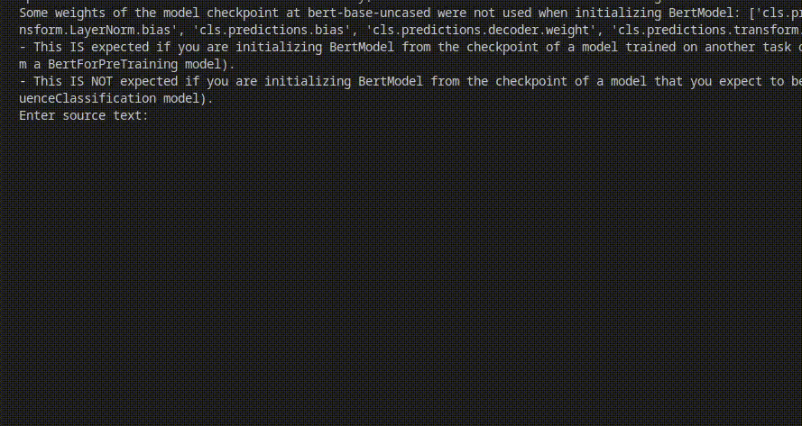

# Transformer for Machine Translation

This is a PyTorch implementation of the Transformer model described in the paper [Attention Is All You Need](https://arxiv.org/abs/1706.03762).

The model is trained to translate from English to Vietnamese on the [IWSLT 2015 dataset](https://sites.google.com/site/iwsltevaluation2015/mt-track?pli=1)

## Usage
First, install the dependencies:
```
pip install -r requirements.txt
```

Then, run the training script:
```bash
python3 src/train.py \
    --accelerator gpu
```

After training, you can run the demo script to translate a sentence:
```bash
python3 src/test.py --ckpt_path <path to checkpoint>
```
where: 
- `<path to checkpoint>` is the path to the checkpoint file you want to use. Default is `./checkpoints/last.ckpt`

